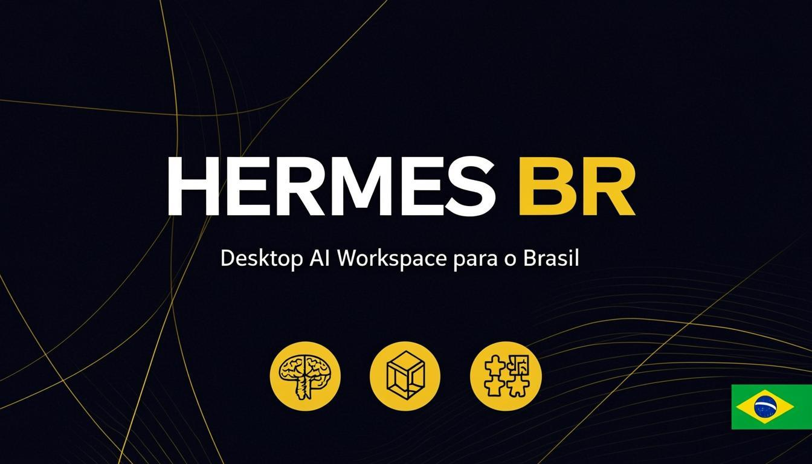

<div align="center">



<br/>
<br/>

**Desktop AI Workspace para o Brasil**

*Sua plataforma de agentes de IA completa, poderosa e 100% em português.*

<br/>

<a href="https://github.com/fathah/hermes-desktop/releases/tag/v0.3.7"></a>
<a href="https://github.com/fathah/hermes-desktop"></a>


<br/>
<br/>

🇧🇷 **Feito para brasileiros. Pensado para o futuro.**

</div>

---

## 🧠 Agentes Inteligentes · 🧊 Memória Persistente · 🧩 MCP Integrado

Hermes BR é um fork brasileiro do [Hermes Desktop](https://github.com/fathah/hermes-desktop) — um aplicativo nativo para instalar, configurar e conversar com o [Hermes Agent](https://github.com/NousResearch/hermes-agent), um assistente de IA que se aprimora sozinho com uso de ferramentas, mensagens multi-plataforma e ciclo de aprendizado fechado.

Em vez de gerenciar o CLI manualmente, o app guia você pela instalação, configuração de provedor e uso diário em um só lugar. Ele usa o script oficial de instalação do Hermes, armazena os dados em `~/.hermes`, e oferece uma GUI para conversa, sessões, perfis, memória, habilidades, ferramentas, agendamentos, gateways de mensagens e muito mais — **tudo em português brasileiro**.

### 🇧🇷 O que muda neste fork?

| Recurso | Upstream (Original) | Hermes BR |
|---------|---------------------|-----------|
| Idioma padrão | Inglês | **Português Brasileiro** |
| Interface | Parcialmente traduzida | **100% traduzida e revisada** |
| Navegação | "Chat", "Soul", "Auto" | "Conversa", "Persona", "Automático" |
| Documentação | Inglês | **Português Brasileiro** |
| Termos técnicos | Mantidos em inglês | **Adaptados para pt-BR** |

---

## 🚀 Instalar

Baixe a versão mais recente na página de [Releases](https://github.com/fathah/hermes-desktop/releases/).

| Plataforma | Arquivo |
|---|---|
| macOS | `.dmg` |
| Linux (qualquer) | `.AppImage` |
| Linux (Debian) | `.deb` |
| Linux (Fedora) | `.rpm` |
| Windows | `.exe` (instalador NSIS) |

### Windows (winget)

```powershell
winget install NousResearch.HermesDesktop
```

> **Usuários Windows:** O instalador não é assinado com código. O SmartScreen do Windows avisará na primeira execução — clique em "Mais informações" → "Executar mesmo assim".

### Fedora (RPM)

```bash
sudo dnf install ./hermes-desktop-<versão>.rpm
```

> **Usuários Fedora:** O `.rpm` não é assinado com GPG. Se seu sistema exige verificação de assinatura, adicione `--nogpgcheck` ao comando de instalação. Atualização automática não é suportada para builds `.rpm` (limitação do `electron-updater`); reinstale o novo `.rpm` para atualizar.

### macOS

> **Usuários macOS:** O app não é assinado ou notarizado. O macOS bloqueará na primeira execução. Para corrigir, execute o seguinte após instalar:
>
> ```bash
> xattr -cr "/Applications/Hermes Agent.app"
> ```
>
> Ou clique com o botão direito no app → **Abrir** → clique **Abrir** no diálogo de confirmação.

---

## ✨ Funcionalidades

<table>
<tr>
<td width="50%">

🔄 **Instalação guiada** para o Hermes Agent com rastreamento de progresso e resolução de dependências

🌐 **Backend local ou remoto** — execute o Hermes localmente em `127.0.0.1:8642`, ou conecte a um servidor API remoto com URL + chave

🔌 **Suporte multi-provedor** — OpenRouter, Anthropic, OpenAI, Google (Gemini), xAI (Grok), Nous Portal, Qwen, MiniMax, Hugging Face, Groq e endpoints locais compatíveis com OpenAI

</td>
<td width="50%">

💬 **Interface de chat com streaming** — SSE streaming, indicadores de progresso de ferramentas, renderização markdown e destaque de sintaxe

📊 **Rastreamento de tokens** — contagens de prompt/completion em tempo real e exibição de custos no rodapé do chat

🗂️ **Gerenciamento de sessões** — busca de texto completo (SQLite FTS5), histórico agrupado por data, retomada e busca em conversas

👤 **Troca de perfis** — crie, exclua e alterne entre ambientes Hermes separados com configuração isolada

</td>
</tr>
</table>

### Mais funcionalidades

- **14 conjuntos de ferramentas** — web, navegador, terminal, arquivo, execução de código, visão, geração de imagens, TTS, habilidades, memória, pesquisa de sessão, esclarecimento, delegação, MoA e planejamento de tarefas
- **Sistema de memória** — visualize/edit entradas de memória, memória de perfil de usuário, rastreamento de capacidade e provedores de memória descobíveis (Honcho, Hindsight, Mem0, RetainDB, Supermemory, ByteRover)
- **Editor de persona** — edite e redefina a personalidade SOUL.md do seu agente
- **Modelos salvos** — gerenciamento CRUD de configurações de modelos entre provedores
- **Tarefas agendadas** — construtor de tarefas cron (minutos, horário, diário, semanal, cron personalizado) com 15 alvos de entrega
- **16 gateways de mensagens** — Telegram, Discord, Slack, WhatsApp, Signal, Matrix, Mattermost, E-mail (IMAP/SMTP), SMS (Twilio/Vonage), iMessage (BlueBubbles), DingTalk, Feishu/Lark, WeCom, WeChat, Webhooks, Home Assistant
- **Escritório Hermes (Claw3D)** — interface visual 3D com servidor de desenvolvimento e gerenciamento de adaptadores
- **Backup, importação e dump de depuração** — backup/restauração completa de dados e diagnósticos do sistema nas Configurações
- **Visualizador de logs** — veja logs do gateway e do agente diretamente da tela de Configurações
- **Atualizador automático** — verifique e instale atualizações via electron-updater
- **22 comandos slash** — `/new`, `/clear`, `/fast`, `/web`, `/image`, `/browse`, `/code`, `/shell`, `/usage`, `/help`, `/tools`, `/skills`, `/model`, `/memory`, `/persona`, `/version`, `/compact`, `/compress`, `/undo`, `/retry`, `/debug`, `/status`
- **i18n completo** — framework de internacionalização com localidade pt-BR cobrindo todas as telas

---

## 🖥️ Telas

| Tela | Descrição |
|------|-----------|
| **Conversa** | Interface de conversa com streaming, comandos slash, progresso de ferramentas e rastreamento de tokens |
| **Sessões** | Navegue, pesquise e retome conversas passadas |
| **Perfis** | Crie, exclua e alterne entre perfis do Hermes |
| **Habilidades** | Navegue, instale e gerencie habilidades instaladas e nativas |
| **Modelos** | Gerencie configurações de modelos salvos por provedor |
| **Memória** | Visualize/edit entradas de memória, perfil de usuário e configure provedores de memória |
| **Persona** | Edite a persona do perfil ativo (SOUL.md) |
| **Ferramentas** | Ative ou desative conjuntos de ferramentas individuais |
| **Agendamentos** | Crie e gerencie tarefas cron com alvos de entrega |
| **Gateway** | Configure e controle integrações de plataformas de mensagens |
| **Escritório** | Configuração e gerenciamento da interface visual Claw3D |
| **Configurações** | Configuração de provedor, pools de credenciais, backup/importação, visualizador de logs, rede, tema |

---

## 🏗️ Como Funciona

Na primeira execução, o app:

1. Pergunta se você quer rodar o Hermes **localmente** ou conectar a um **servidor** API remoto do Hermes.
2. **Modo local:** verifica se o Hermes já está instalado em `~/.hermes`; se não, executa o instalador oficial com resolução de dependências (Git, uv, Python 3.11+).
3. **Modo remoto:** solicita a URL da API remota e a chave API, valida a conexão e pula a instalação local.
4. Solicita um provedor de API ou endpoint de modelo local.
5. Salva a configuração do provedor e as chaves API através dos arquivos de configuração do Hermes.
6. Inicia o espaço de trabalho principal após a conclusão da configuração.

No modo local, as requisições de chat passam por `http://127.0.0.1:8642` com streaming SSE. No modo remoto, o app se comunica com sua URL remota configurada com o mesmo protocolo de streaming. O app desktop analisa o stream em tempo real, renderizando o progresso das ferramentas, conteúdo markdown e uso de tokens conforme chegam.

---

## 🛠️ Stack Técnica

| Tecnologia | Uso |
|---|---|
| **Electron** 39 | Shell desktop multi-plataforma |
| **React** 19 | Framework de UI |
| **TypeScript** 5.9 | Segurança de tipos nos processos main e renderer |
| **Tailwind CSS** 4 | Estilização utility-first |
| **Vite** 7 + electron-vite | Servidor de desenvolvimento rápido e ferramentas de build |
| **better-sqlite3** | Armazenamento local de sessões com busca de texto completo FTS5 |
| **i18next** | Framework de internacionalização (pt-BR como padrão) |
| **Vitest** | Executor de testes |

---

## 💻 Desenvolvimento

### Pré-requisitos

- Node.js e npm
- Um ambiente shell Unix-like para o instalador do Hermes
- Acesso à rede para baixar o Hermes durante a instalação inicial

### Instalar dependências

```bash
npm install
```

### Iniciar o app em desenvolvimento

```bash
npm run dev
```

### Executar verificações

```bash
npm run lint
npm run typecheck
```

### Executar testes

```bash
npm run test
npm run test:watch
```

### Build do app desktop

```bash
npm run build
```

Empacotamento por plataforma:

```bash
npm run build:mac
npm run build:win
npm run build:linux
npm run build:rpm    # Fedora/RHEL .rpm apenas
```

---

## 📁 Arquivos do Hermes

Os arquivos do Hermes são gerenciados em:

- `~/.hermes` — diretório raiz
- `~/.hermes/.env` — variáveis de ambiente
- `~/.hermes/config.yaml` — configuração
- `~/.hermes/hermes-agent` — binário do agente
- `~/.hermes/profiles/` — diretórios de perfis nomeados
- `~/.hermes/state.db` — banco de dados de histórico de sessões
- `~/.hermes/cron/jobs.json` — tarefas agendadas

---

## 🤝 Contribuindo

Contribuições são bem-vindas! Confira o [Guia de Contribuição](CONTRIBUTING.md) para começar. Se não tiver certeza por onde começar, dê uma olhada nas [issues abertas](https://github.com/fathah/hermes-desktop/issues). Encontrou um bug ou tem uma sugestão? [Abra uma issue](https://github.com/fathah/hermes-desktop/issues/new).

---

## 📌 Projetos Relacionados

Para o agente principal, documentação e fluxos de trabalho CLI, veja o repositório principal do Hermes Agent:

- https://github.com/NousResearch/hermes-agent

---

<div align="center">

**Hermes BR. O poder da IA na sua mesa.**

🪟 Windows 10/11 · 🔓 Código Aberto · ❤️ Feito com paixão no Brasil

</div>
